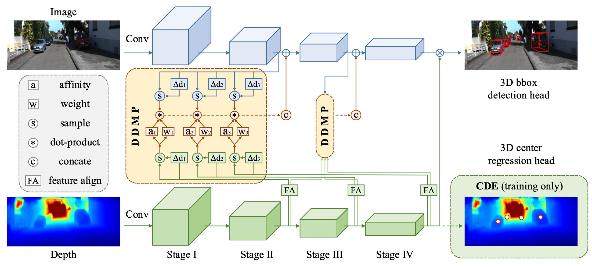

# DDMP-3D
Pytorch implementation of [Depth-conditioned Dynamic Message Propagation forMonocular 3D Object Detection](https://arxiv.org/pdf/2103.16470.pdf), a paper on CVPR2021.

## Instroduction
The objective of this paper is to learn context- and depthaware feature representation to solve the problem of monocular 3D object detection. We make following contributions: 
(i) rather than appealing to the complicated pseudo-LiDAR
based approach, we propose a depth-conditioned dynamic
message propagation (DDMP) network to effectively integrate the multi-scale depth information with the image
context; (ii) this is achieved by first adaptively sampling
context-aware nodes in the image context and then dynamically predicting hybrid depth-dependent filter weights and
affinity matrices for propagating information; (iii) by augmenting a center-aware depth encoding (CDE) task, our
method successfully alleviates the inaccurate depth prior;
(iv) we thoroughly demonstrate the effectiveness of our proposed approach and show state-of-the-art results among
the monocular-based approaches on the KITTI benchmark
dataset.



## Requirements

#### Installation

Our code is based on [DGMN](https://github.com/lzrobots/dgmn), please refer to the [installation](https://github.com/lzrobots/dgmn/blob/master/INSTALL.md) for maskrcnn-benchmark compilation.

- **My settings**

  ```shell
  	conda activate maskrcnn_benchmark 
	(maskrcnn_benchmark)  conda list
	python 				   3.8.5
	pytorch                            1.4.0          
	cudatoolkit          	           10.0.130  
	torchfile                          0.1.0
	torchvision                        0.5.0
	apex                     	   0.1 
  ```


## Data preparation

Download and unzip the full [KITTI](http://www.cvlibs.net/datasets/kitti/eval_object.php?obj_benchmark=3d) detection dataset to the folder **/path/to/kitti/**. Then place a softlink (or the actual data) in **data/kitti/**. There are two widely used training/validation set splits for the KITTI dataset. Here we only show the setting of **split1**, you can set **split2** accordingly.

  ```shell
cd D4LCN
ln -s /path/to/kitti data/kitti
ln -s /path/to/kitti/testing data/kitti_split1/testing
  ```

Our method uses [DORN](https://github.com/hufu6371/DORN) (or other monocular depth models) to extract depth maps for all images. You can download and unzip the depth maps extracted by DORN [here](https://drive.google.com/open?id=1lSJpQ8GUCxRNtWxo0lduYAbWkkXQa2cb) and put them (or softlink) to the folder **data/kitti/depth_2/**. (You can also change the path in the scripts **setup_depth.py**)

Then use the following scripts to extract the data splits, which use softlinks to the above directory for efficient storage.


  ```shell
python data/kitti_split1/setup_split.py
python data/kitti_split1/setup_depth.py
  ```

Next, build the KITTI devkit eval for split1.

```shell
sh data/kitti_split1/devkit/cpp/build.sh
```

Lastly, build the nms modules

```shell
cd lib/nms
make
```

## Training

You can change the batch_size according to the number of GPUs, default: 8 GPUs with batch_size = 5 on Tesla v100(32G).

If you want to utilize the resnet backbone pre-trained on the COCO dataset, it can be downloaded from [git](https://github.com/ruotianluo/pytorch-faster-rcnn) or [Google Drive](https://drive.google.com/drive/folders/0B7fNdx_jAqhtNE10TDZDbFRuU0E), default: ImageNet pretrained pytorch model. You can also set use_corner and corner_in_3d to False for quick training.

See the configurations in **scripts/config/config.py** and **scripts/train.py** for details. 

``` 
sh train.sh
```

## Testing

Generate the results using:

```
python scripts/test.py
```
we afford the generated results for evaluation due to the tedious process of data preparation process. Unzip the output.zip and then execute the above evaluation commonds. We show the results in paper, and best model in supplementary. Additionally, we also trained a model replacing the depth map (only contains value of z) with coordinate xyz (xy are the values along x and y axises on 2D plane).

| Models | AP3D11@mod. | AP3D11@easy| AP3D11@hard|
| -------- | ------- | -------- | ------- |
| model in paper| 23.13 / 27.46 | 31.14 / 37.71 | 19.45 / 24.53 |
|[best model]() | 23.17 / 27.85 | 32.40 / 42.05 | 19.35 / 24.91 |
| [model with coordinate(xyz)]() | 23.53 / 28.16 | 30.21 / 38.78 | 19.72 / 24.80 |


## Acknowledgements

We thank [D4LCN](https://github.com/dingmyu/D4LCN) and [DGMN](https://github.com/lzrobots/dgmn) for their great works and repos.

## Citation

If you find this project useful in your research, please consider citing:

```
@inproceedings{wang2021depth,
  title={Depth-conditioned Dynamic Message Propagation for Monocular 3D Object Detection},
  author={Wang, Li and Du, Liang and Ye, Xiaoqing and Fu, Yanwei and Guo, Guodong and Xue, Xiangyang and Feng, Jianfeng and Zhang, Li},
  booktitle={Proceedings of the IEEE/CVF Conference on Computer Vision and Pattern Recognition},
  pages={454--463},
  year={2021}
}
```

## Contact

For questions regarding DDMP-3D, feel free to post here or directly contact the authors (wangli16@fudan.edu.cn).

